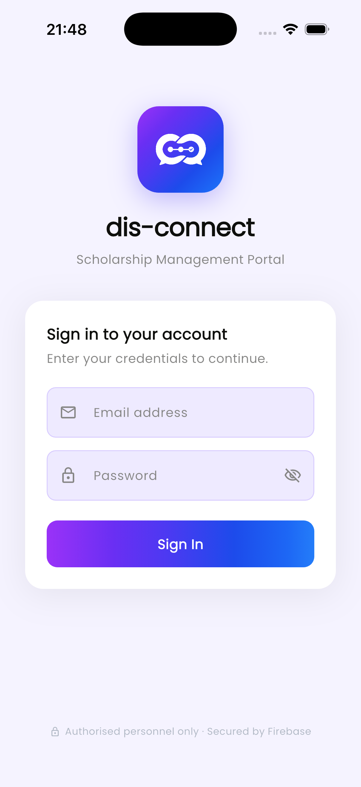
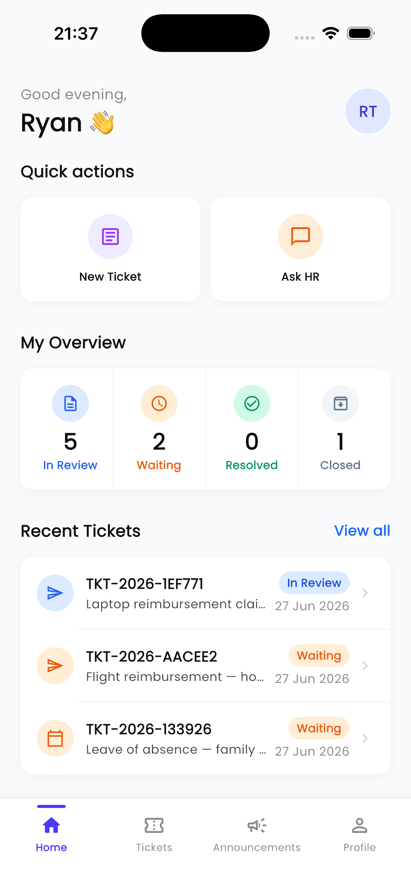
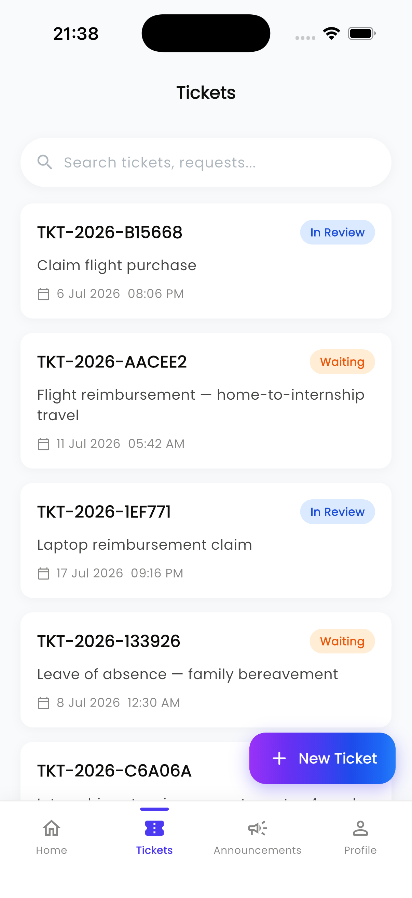
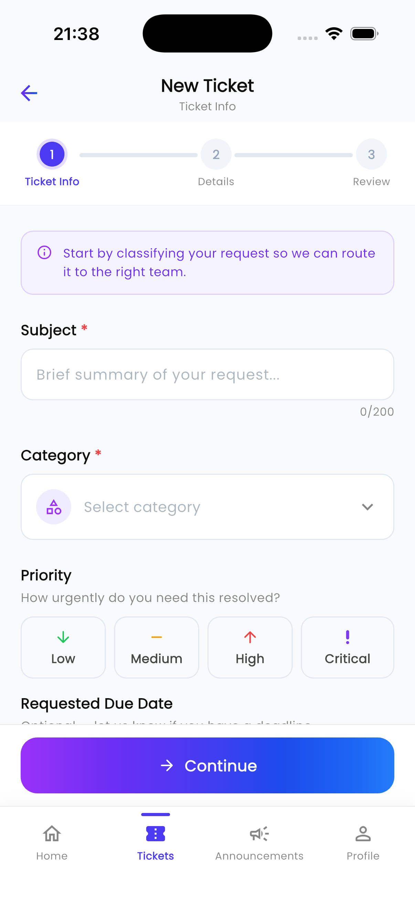
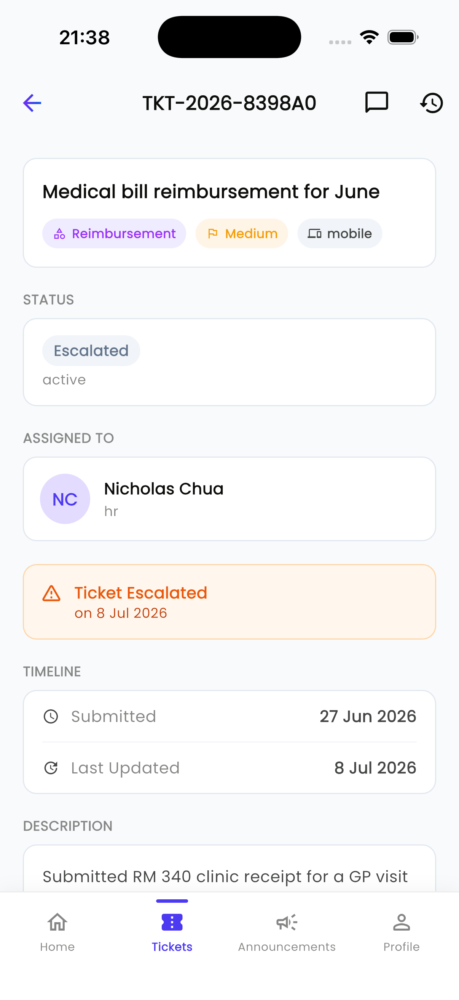
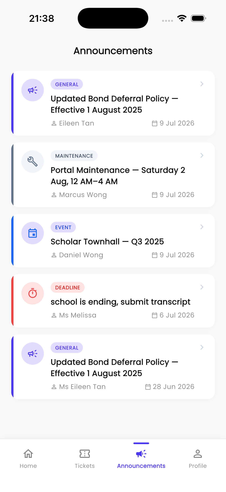
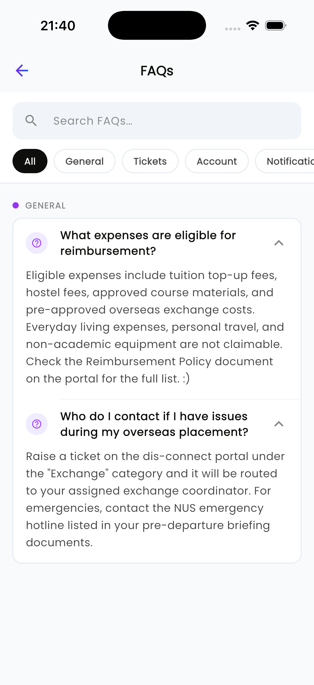
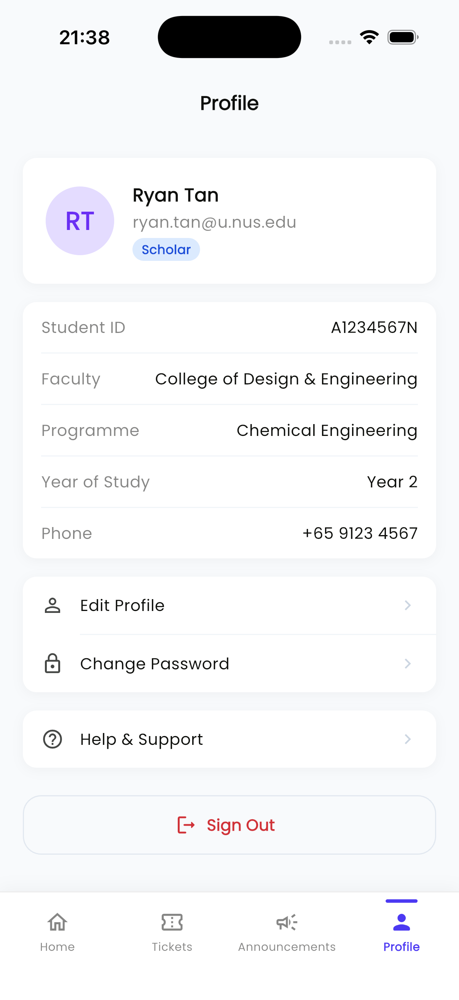
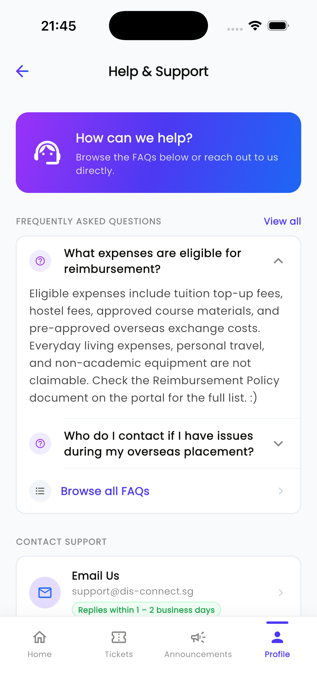

# DisConnect Mobile

A Flutter mobile application for scholars to manage support tickets, view announcements, browse FAQs, and communicate with scholarship administrators — all in one place.

---

## Table of Contents

- [Overview](#overview)
- [Screenshots](#screenshots)
- [Features](#features)
- [Tech Stack](#tech-stack)
- [Project Structure](#project-structure)
- [Architecture](#architecture)
- [Real-Time Updates](#real-time-updates)
- [Status Colour System](#status-colour-system)
- [App Routes](#app-routes)
- [Prerequisites](#prerequisites)
- [Getting Started](#getting-started)
- [Environment Switching](#environment-switching)
- [Firebase Setup](#firebase-setup)
- [Testing](#testing)

---

## Overview

DisConnect Mobile is the scholar-facing interface of the DisConnect platform. Scholars can:

- File support tickets for scholarship-related matters (reimbursements, internship forms, leave requests, etc.)
- Track ticket status and audit history
- Message assigned HR officers within a ticket conversation thread
- Stay up-to-date with notices from HR via the Announcements feed
- Browse a searchable FAQ library for quick self-service answers
- Manage their profile (display name, password)

The app authenticates via **Firebase Authentication** and communicates with a **FastAPI** backend using a Firebase ID token as a Bearer token. File attachments are uploaded directly to **Firebase Storage**. Real-time change notifications use **Cloud Firestore** snapshot listeners that trigger REST re-fetches, keeping the UI current without polling.

---

## Screenshots

| Login                                               | Home                                               | Tickets                                               |
| --------------------------------------------------- | -------------------------------------------------- | ----------------------------------------------------- |
|  |  |  |

| Create Ticket                                               | Ticket Detail                                               | Announcements                                               |
| ----------------------------------------------------------- | ----------------------------------------------------------- | ----------------------------------------------------------- |
|  |  |  |

| FAQs                                               | Profile                                               | Help & Support                                                 |
| -------------------------------------------------- | ----------------------------------------------------- | -------------------------------------------------------------- |
|  |  |  |

---

## Features

### Module overview

| Module             | Description                                                                                                    |
| ------------------ | -------------------------------------------------------------------------------------------------------------- |
| **Authentication** | Email/password sign-in via Firebase Auth with per-request ID-token injection                                   |
| **Home Dashboard** | Greeting card, ticket overview stats, recent 3 tickets, quick-action shortcuts, latest announcement banner     |
| **Tickets**        | Full ticket lifecycle — browse, search, create (3-step form), view details, conversation thread, audit history |
| **Announcements**  | Real-time feed of HR notices sorted newest-first, with colour-coded category badges and a full detail view     |
| **FAQ**            | Searchable, category-filtered library of frequently asked questions with collapsible answers                   |
| **Profile**        | View profile, edit display name, change password, Help & Support screen, sign out                              |

### Ticket creation — 3-step form

| Step                | Fields                                                                            |
| ------------------- | --------------------------------------------------------------------------------- |
| 1 · Ticket Info     | Subject, Category (API-fetched), Priority (API-fetched, optional)                 |
| 2 · Details         | Description, Requested Due Date (date-only, stored in local timezone)             |
| 3 · Review & Attach | File attachments (PDF / images / Office docs, up to 10 MB each) with live preview |

Attachment upload flow:

```
CreateTicketScreen._submit()
  ├─ POST /api/v1/tickets           →  receive ticket_id
  ├─ FirebaseStorage.putData()      →  upload to tickets/{ticket_id}/{filename}
  └─ POST /api/v1/tickets/:id/attachments  →  record metadata on backend
```

### Ticket list — Active / Resolved split

The list screen partitions tickets into two sections using the same filter logic that is independently unit-tested:

- **Active** — Open, In Review, Waiting (no section header; tickets appear directly at the top)
- **RESOLVED & CLOSED** — Resolved, Closed (separated by a divider showing the count)

A live search bar filters across title, display ID, category, and status simultaneously, updating instantly without a network call.

### Announcements

The announcements feed displays HR notices sorted newest-first. Each card shows a colour-coded category badge, the announcement title, author name, and date. Tapping a card pushes the full detail view. Pull-to-refresh re-fetches the list from the REST API. The six supported categories are:

`General` · `Deadline` · `Event` · `Maintenance` · `Urgent` · `Result`

Each category has its own colour palette defined in `announcementCategoryStyle()`. There are no category filter chips on this screen.

### FAQ screen

The standalone FAQ screen (`/faqs`) and the embedded preview in Help & Support both pull from the same REST endpoint. Features:

- Full-text search (filters question and answer body)
- Category chip filter: `All` · `General` · `Tickets` · `Account` · `Notifications` · `Files`
- Collapsible `ExpansionTile` rows showing the answer inline
- Real-time refresh via Firestore `faqs` collection listener

---

## Tech Stack

| Layer                | Technology                                                                                                                                             |
| -------------------- | ------------------------------------------------------------------------------------------------------------------------------------------------------ |
| Framework            | Flutter (Dart `^3.11.5`)                                                                                                                               |
| Navigation           | GoRouter (`^17.2.3`)                                                                                                                                   |
| Authentication       | Firebase Auth (`firebase_auth ^6.5.1`)                                                                                                                 |
| Realtime signals     | Cloud Firestore (`cloud_firestore ^6.4.1`)                                                                                                             |
| Realtime DB          | Firebase Realtime Database (`firebase_database ^12.4.4`)                                                                                               |
| File storage         | Firebase Storage (`firebase_storage ^13.4.2`)                                                                                                          |
| Backend API          | FastAPI (Python) — REST over HTTPS                                                                                                                     |
| HTTP client          | `http ^1.6.0` with Firebase ID-token injection                                                                                                         |
| File picker          | `file_picker ^11.0.2`                                                                                                                                  |
| Fonts                | `google_fonts ^8.1.0` — Poppins typeface applied globally via `AppTheme.lightTheme`                                                                    |
| SVG rendering        | `flutter_svg ^2.3.0` — renders the logo SVG on the login screen                                                                                        |
| Internationalisation | `intl ^0.20.2`                                                                                                                                         |
| State management     | `StatefulWidget` (plain Flutter) — `flutter_riverpod ^3.3.1` is declared in `pubspec.yaml` but is not used anywhere in the codebase and can be removed |
| **Testing**          | `flutter_test` + `integration_test` + `mocktail ^1.0.5`                                                                                                |

---

## Project Structure

```
lib/
├── app/
│   ├── app.dart                        # Root MaterialApp.router
│   └── router.dart                     # GoRouter — all named routes + auth redirect
│
├── core/
│   ├── constants/
│   │   └── app_constants.dart
│   ├── network/
│   │   └── api_client.dart             # HTTP client: GET/POST + Bearer token injection
│   ├── theme/
│   │   ├── app_theme.dart              # ThemeData
│   │   └── design_system.dart          # AppColors, AppTypography, AppBorderRadius, GradientIcon
│   └── widgets/
│       └── app_button.dart
│
├── features/
│   ├── auth/
│   │   ├── data/
│   │   │   └── auth_repository.dart
│   │   └── presentation/
│   │       └── login_screen.dart
│   │
│   ├── home/
│   │   ├── presentation/
│   │   │   └── home_screen.dart        # Loads tickets + latest announcement on init
│   │   └── widgets/
│   │       ├── greeting_header.dart    # "Good morning, Name" + avatar
│   │       ├── overview_stats_card.dart  # In Review / Waiting / Resolved / Closed counts
│   │       ├── quick_actions_section.dart  # New Ticket + Ask HR shortcuts
│   │       ├── recent_tickets_section.dart # Last 3 tickets sorted by updatedAt
│   │       └── announcement_banner.dart    # Gradient card showing latest AnnouncementEntry
│   │
│   ├── tickets/
│   │   ├── data/
│   │   │   └── ticket_repository.dart  # getTickets, getTicket, createTicket, createAttachment,
│   │   │                               # getMessages, sendMessage, getHistory,
│   │   │                               # getCategories, getPriorities, getStatuses
│   │   ├── models/
│   │   │   └── ticket_model.dart       # Ticket (list model) + toJson/fromJson
│   │   ├── presentation/
│   │   │   ├── ticket_list_screen.dart         # Live search, Active/Resolved sections, auto-refresh
│   │   │   ├── create_ticket_screen.dart       # 3-step PageView form + file attachments
│   │   │   ├── ticket_detail_screen.dart       # Full detail + Firestore live-update + TicketDetailData
│   │   │   ├── ticket_conversation_screen.dart # Firebase Realtime DB message thread
│   │   │   └── ticket_history_screen.dart      # Audit log timeline
│   │   └── widgets/
│   │       ├── search_bar.dart
│   │       └── ticket_status_badge.dart  # ticketStatusStyle(), statusSortOrder(), TicketStatusBadge
│   │
│   ├── announcements/
│   │   ├── data/
│   │   │   └── announcement_repository.dart
│   │   └── presentation/
│   │       ├── announcements_screen.dart     # AnnouncementEntry model + Firestore listener + REST fetch
│   │       └── announcement_detail_screen.dart
│   │
│   ├── faq/
│   │   ├── data/
│   │   │   └── faq_repository.dart       # FaqEntry model + getFaqs() REST call
│   │   └── presentation/
│   │       └── faq_screen.dart           # Search + category filter + Firestore listener
│   │
│   └── profile/
│       ├── data/
│       │   └── user_repository.dart      # UserProfile model + getUserById()
│       └── presentation/
│           ├── profile_screen.dart
│           ├── edit_profile_screen.dart        # Updates Firebase Auth displayName
│           ├── change_password_screen.dart     # Re-auth + updatePassword via Firebase Auth
│           └── help_support_screen.dart        # FAQ preview + contact section + quick tips
│
├── shared/
│   └── widgets/
│       └── main_shell.dart             # StatefulShellRoute bottom nav (Home | Tickets | Announcements | Profile)
│
├── firebase_options.dart               # Generated by FlutterFire CLI
└── main.dart                           # Entry point: Firebase.initializeApp() + runApp()

test/
├── logic/
│   └── ticket_filter_test.dart         # Active/resolved partition + search filter logic (22 tests)
├── models/
│   ├── announcement_model_test.dart    # AnnouncementEntry.fromJson edge cases (19 tests)
│   ├── faq_model_test.dart             # FaqEntry.fromJson (6 tests)
│   ├── ticket_model_test.dart          # Ticket.fromJson, toJson, _parseDate (13 tests)
│   └── ticket_detail_data_test.dart    # TicketDetailData.fromJson (34 tests)
├── repositories/
│   └── ticket_repository_test.dart     # All TicketRepository methods mocked via mocktail (18 tests)
└── widgets/
    ├── announcement_banner_test.dart   # AnnouncementBanner rendering + tap (6 tests)
    ├── overview_stats_card_test.dart   # OverviewStatsCard counts + headings (12 tests)
    ├── quick_actions_section_test.dart # QuickActionsSection cards + navigation (7 tests)
    ├── recent_tickets_section_test.dart # RecentTicketsSection all states (12 tests)
    └── ticket_status_badge_test.dart   # TicketStatusBadge + ticketStatusStyle + statusSortOrder (21 tests)

integration_test/
├── helpers/
│   └── app_driver.dart                 # launchApp, signIn, signOut, tapNavTab, pumpSeconds
├── login_test.dart                     # Screen rendering, validation, password toggle, auth flows (17 tests)
├── navigation_test.dart                # Tab navigation, state preservation, quick actions (8 tests)
├── ticket_test.dart                    # Ticket list, create flow, step validation (15 tests)
├── announcement_test.dart              # Announcements screen, chips, refresh, detail (6 tests)
├── profile_test.dart                   # Profile structure, sub-screen nav, sign-out flow (12 tests)
└── faq_test.dart                       # Help & Support, FAQ expansion, search, filters (9 tests)
```

---

## Architecture

The project follows a **feature-first** folder structure. Each product feature owns its own `data/`, `models/`, `presentation/`, and `widgets/` layers.

### Authentication flow

```
App launch
  └─ Firebase.initializeApp()
       └─ GoRouter auth redirect
            ├─ No signed-in user  →  /login
            └─ Signed-in user     →  /home
```

### API request flow

```
Screen / Widget
  └─ Repository method call (e.g. TicketRepository.getTickets())
       └─ ApiClient.get() / .post()
            └─ Attaches a fresh Firebase ID token as  Authorization: Bearer <token>
                 └─ FastAPI backend verifies token  →  returns JSON
```

### Ticket detail model

`TicketDetailData` is a richer model used only by the detail screen (as opposed to `Ticket` used in the list). It carries the full API payload:

| Field group      | Fields                                                      |
| ---------------- | ----------------------------------------------------------- |
| Identity         | `ticketCode`, `subject`, `category`                         |
| Status           | `statusName`, `statusType`, `isClosed`                      |
| Content          | `description`, `source`                                     |
| Assigned officer | `officerName`, `officerRole`, `officerInitials`             |
| Escalation       | `isEscalated`, `escalatedToName`, `escalatedAt`             |
| Dates            | `createdAt`, `updatedAt`, `dueAt`, `resolvedAt`, `closedAt` |
| Attachments      | `List<AttachmentFile>` — `name`, `sizeKb`                   |

---

## Real-Time Updates

Three screens use a **hybrid REST + Firestore** pattern to stay current without polling:

1. **Ticket detail screen** — listens to the `tickets` Firestore collection
2. **Announcements screen** — listens to the `announcements` Firestore collection
3. **FAQ screen** — listens to the `faqs` Firestore collection

**How it works:**

```
initState()
  ├─ _load()                    # REST fetch → populates UI immediately
  └─ _subscribeToChanges()      # Firestore snapshot listener starts

Firestore emits first snapshot (reflects current DB state)
  └─ _firstSnapshot flag = true → skip (avoids redundant re-fetch on load)

Firestore emits subsequent snapshot (triggered by HR creating/editing on web)
  └─ _firstSnapshot flag = false → call _refresh()
       └─ REST fetch → updates UI with new data
```

This means Firestore is used only as a **change signal** — the actual data always comes from the REST API (which is covered by auth, pagination, and business logic). Firestore documents themselves are never read for display data.

### Required Firestore security rules

The snapshot listener must be able to read the collections to receive events. Add the following rules in the Firebase Console under **Firestore → Rules**:

```
rules_version = '2';
service cloud.firestore {
  match /databases/{database}/documents {
    match /tickets/{docId} {
      allow read: if request.auth != null;
    }
    match /announcements/{docId} {
      allow read: if request.auth != null;
    }
    match /faqs/{docId} {
      allow read: if request.auth != null;
    }
    // Deny everything else
    match /{document=**} {
      allow read, write: if false;
    }
  }
}
```

---

## Status Colour System

`ticket_status_badge.dart` exports two pure functions used across every screen that displays a ticket status:

### `ticketStatusStyle(String status)`

Returns a `TicketStatusStyle` with `badgeBg`, `badgeText`, `iconBg`, `iconColor`:

| Status           | Badge background      | Badge text             |
| ---------------- | --------------------- | ---------------------- |
| In Review        | `#DBEAFE` (blue-50)   | `#1D4ED8` (blue-700)   |
| Waiting          | `#FFEDD5` (orange-50) | `#EA580C` (orange-600) |
| Open             | `#EDE9FE` (violet-50) | `#7C3AED` (violet-600) |
| Resolved         | `#D1FAE5` (green-50)  | `#059669` (green-600)  |
| Closed / unknown | `#F1F5F9` (slate-50)  | `#64748B` (slate-500)  |

Matching is **case-insensitive** (`'IN REVIEW'` → same palette as `'In Review'`).

### `statusSortOrder(String status)`

Returns an integer priority so ticket lists always group active work at the top:

```
In Review (0) → Waiting (1) → Open (2) → Resolved (3) → Closed/unknown (4)
```

---

## App Routes

| Path                        | Screen                                             |
| --------------------------- | -------------------------------------------------- |
| `/login`                    | Login                                              |
| `/home`                     | Home dashboard                                     |
| `/tickets`                  | Ticket list (searchable, Active/Resolved sections) |
| `/tickets/create`           | Create ticket (3-step form)                        |
| `/tickets/:id`              | Ticket detail (Firestore live-update)              |
| `/tickets/:id/conversation` | Conversation & messages (Firebase Realtime DB)     |
| `/tickets/:id/history`      | Ticket audit history                               |
| `/announcements`            | Announcements feed (Firestore live-update)         |
| `/announcements/:id`        | Announcement detail                                |
| `/faqs`                     | FAQ standalone screen                              |
| `/profile`                  | Scholar profile                                    |
| `/profile/edit`             | Edit display name                                  |
| `/profile/change-password`  | Change password                                    |
| `/profile/help`             | Help & Support (FAQ preview + contact)             |

All authenticated routes are nested inside a `StatefulShellRoute.indexedStack` that keeps each tab's navigation stack alive when switching tabs.

---

## Prerequisites

| Requirement                                                 | Notes                                                                             |
| ----------------------------------------------------------- | --------------------------------------------------------------------------------- |
| [Flutter SDK](https://docs.flutter.dev/get-started/install) | Stable channel, Dart `^3.11.5`                                                    |
| [Xcode](https://developer.apple.com/xcode/)                 | iOS 17+ SDK (for iOS simulator / device)                                          |
| [Android Studio](https://developer.android.com/studio)      | With Android SDK (for Android emulator / device)                                  |
| [CocoaPods](https://cocoapods.org/)                         | `sudo gem install cocoapods`                                                      |
| Firebase Project                                            | Authentication (email/password) + Firestore + Storage + Realtime Database enabled |
| FastAPI Backend                                             | Running with `--host 0.0.0.0` (see Getting Started)                               |

Verify your Flutter environment before proceeding:

```bash
flutter doctor
```

---

## Getting Started

### 1. Clone the repository

```bash
git clone <repository-url>
cd disconnect_mobile
```

### 2. Configure Firebase

The native Firebase config files are **not committed to version control** and must be added manually.

**Android — `google-services.json`**

1. Firebase Console → your project → Project Settings → Android app
2. Download `google-services.json`
3. Place it at `android/app/google-services.json`

**iOS — `GoogleService-Info.plist`**

1. Firebase Console → Project Settings → iOS app
2. Download `GoogleService-Info.plist`
3. Place it at `ios/Runner/GoogleService-Info.plist`

> To regenerate `firebase_options.dart` after adding a new Firebase product:
>
> ```bash
> dart pub global activate flutterfire_cli
> flutterfire configure
> ```

### 3. Install Flutter dependencies

```bash
flutter pub get
```

### 4. Install iOS CocoaPods

```bash
cd ios && pod install && cd ..
```

### 5. Start the backend

```bash
uvicorn app.main:app --host 0.0.0.0 --port 8000 --reload
```

### 6. Run the app

```bash
flutter devices               # list connected devices and simulators
flutter run -d ios            # iOS Simulator
flutter run -d android        # Android Emulator
flutter run -d <device-id>    # specific device
```

### 7. Build for release (optional)

```bash
flutter build apk --release          # Android APK
flutter build appbundle --release     # Android App Bundle (Play Store)
flutter build ios --release           # iOS (requires provisioning profile)
```

---

## Environment Switching

`ApiClient` (`lib/core/network/api_client.dart`) supports three environments via a compile-time enum:

```dart
enum _Env { local, localDevice, deployed }
static const _Env _env = _Env.deployed;   // ← change this line to switch
```

| Value              | URL                                | Use when                                                                             |
| ------------------ | ---------------------------------- | ------------------------------------------------------------------------------------ |
| `_Env.local`       | `http://127.0.0.1:8000`            | iOS Simulator on the same Mac as the server                                          |
| `_Env.localDevice` | `http://192.168.1.x:8000`          | Real device on the same LAN — update the IP to your Mac's (`ipconfig getifaddr en0`) |
| `_Env.deployed`    | Firebase Cloud Functions HTTPS URL | Production / staging                                                                 |

---

## Firebase Setup

### Firestore collections used as change signals

| Collection      | Used by                     | Purpose                                                  |
| --------------- | --------------------------- | -------------------------------------------------------- |
| `tickets`       | `ticket_detail_screen.dart` | Notifies the detail screen when HR updates a ticket      |
| `announcements` | `announcements_screen.dart` | Notifies the feed when HR posts or edits an announcement |
| `faqs`          | `faq_screen.dart`           | Notifies the FAQ screen when HR adds or changes an FAQ   |

See [Real-Time Updates](#real-time-updates) for the required Firestore security rules.

### Firebase Realtime Database layout

The conversation screen listens to `ticket_messages/{ticketId}` with a persistent `onValue` stream. Each child node is a message object keyed by its `message_id`:

```
ticket_messages/
  {ticket_id}/
    {message_id}/
      message_id    : string
      sender_id     : string   ← matched against Firebase Auth UID to set isMe
      sender_name   : string
      sender_role   : string
      message_text  : string
      created_at    : ISO-8601 string
      attachments   : list of { file_name }
```

Messages are sorted client-side by `created_at` string comparison after the snapshot arrives.

### Firebase Storage bucket layout

```
tickets/
  {ticket_id}/
    {filename}      ← attachments uploaded during ticket creation
```

---

## Testing

The test suite is split into three layers: unit tests, widget tests, and end-to-end integration tests.

### Run all unit and widget tests

```bash
flutter test test/
```

All **171 tests** pass with no Firebase dependency — they run entirely in the Dart VM.

> `test/widget_test.dart` is the default file Flutter generates on project creation. It is kept as an intentional empty placeholder (`void main() {}`) because the app's widget tests live in `test/widgets/` instead. It contributes 0 tests to the total.

### Test breakdown by file

#### Unit tests — models

| File                                       | Tests | What is covered                                                                                                                               |
| ------------------------------------------ | ----- | --------------------------------------------------------------------------------------------------------------------------------------------- |
| `test/models/ticket_model_test.dart`       | 13    | `Ticket.fromJson` with nested objects, flat strings, missing fields; `toJson` round-trip; `_parseDate` with null and malformed values         |
| `test/models/ticket_detail_data_test.dart` | 34    | `TicketDetailData.fromJson` — all field groups: status, officer, escalation, dates, attachments, priority colour hex parsing                  |
| `test/models/announcement_model_test.dart` | 19    | `AnnouncementEntry.fromJson` with complete payload, missing optional fields, date parsing for both ISO-8601 strings and Firestore `Timestamp` |
| `test/models/faq_model_test.dart`          | 6     | `FaqEntry.fromJson` with full and partial JSON                                                                                                |

#### Unit tests — repository

| File                                            | Tests | What is covered                                                                                                                                                                                              |
| ----------------------------------------------- | ----- | ------------------------------------------------------------------------------------------------------------------------------------------------------------------------------------------------------------ |
| `test/repositories/ticket_repository_test.dart` | 18    | All `TicketRepository` methods (`getTickets`, `createTicket`, `getStatuses`, `getCategories`, `getPriorities`, `getMessages`, etc.) mocked via `mocktail`; verifies correct endpoint URLs and request bodies |

#### Unit tests — logic

| File                                 | Tests | What is covered                                                                                                                                                                          |
| ------------------------------------ | ----- | ---------------------------------------------------------------------------------------------------------------------------------------------------------------------------------------- |
| `test/logic/ticket_filter_test.dart` | 22    | Active/resolved partition (`isDone`), search filter (`visible`), combined filter helpers (`active`, `resolved`); covers empty queries, case-insensitive matching, and cross-field search |

#### Widget tests

Each file pumps the target widget in a minimal `MaterialApp` scaffold with no Firebase required.

| File                                            | Tests | What is covered                                                                                                                                                                                                                                                              |
| ----------------------------------------------- | ----- | ---------------------------------------------------------------------------------------------------------------------------------------------------------------------------------------------------------------------------------------------------------------------------- |
| `test/widgets/ticket_status_badge_test.dart`    | 21    | `TicketStatusBadge` text rendering and `fontSize` forwarding (8); `ticketStatusStyle()` colour mapping for every status (7); `statusSortOrder()` values and case-insensitivity (6)                                                                                           |
| `test/widgets/overview_stats_card_test.dart`    | 13    | Section heading, all four stat labels, count display, all-zeros state, large numbers without overflow, `TicketOverview` model defaults                                                                                                                                       |
| `test/widgets/recent_tickets_section_test.dart` | 12    | Empty state message, 'View all' link, `displayId`/title/status/date rendering, `createdAt: null` hides date row, `onTicketTap` fires with correct object, `onViewAll` callback, null-callback safety, multiple tickets all rendered, empty-state hidden when tickets present |
| `test/widgets/announcement_banner_test.dart`    | 6     | Title display, formatted date (`d MMM yyyy h:mm a`), 'View details' button, campaign icon, `onTap` callback fires, `onTap: null` does not crash                                                                                                                              |
| `test/widgets/quick_actions_section_test.dart`  | 7     | Both cards visible ('New Ticket', 'Ask HR'), section heading, icons, navigation to create-ticket screen, navigation to help screen                                                                                                                                           |

### Integration tests

Integration tests boot the full app on a connected device or simulator. Tests that require a signed-in user are guarded by `skip: !credentialsAvailable` and are skipped automatically when credentials are not provided.

#### Running integration tests

**1. Create a dedicated test Firebase account** — never use a real scholar's credentials.

**2. Run with credentials injected at compile time:**

```bash
flutter test integration_test/ \
  --dart-define=TEST_EMAIL=testscholar@example.com \
  --dart-define=TEST_PASSWORD=yourTestPassword
```

**3. Single file:**

```bash
flutter test integration_test/login_test.dart \
  --dart-define=TEST_EMAIL=... \
  --dart-define=TEST_PASSWORD=...
```

The credentials are injected via `String.fromEnvironment()` — they are never committed to source control.

#### Why `skip: !credentialsAvailable`?

Tests in groups A–C of `login_test.dart` (screen rendering, empty-field validation, password toggle) do not need Firebase at all and always run. Every other test requires a live Firebase session and is gracefully skipped in CI environments where credentials are not available.

#### Integration test breakdown

| File                                      | Tests | Groups covered                                                                                                                                                                                                                                                                                                                                  |
| ----------------------------------------- | ----- | ----------------------------------------------------------------------------------------------------------------------------------------------------------------------------------------------------------------------------------------------------------------------------------------------------------------------------------------------- |
| `integration_test/login_test.dart`        | 17    | Screen renders heading/fields/button (A); empty and partial field validation without Firebase (B); password visibility toggle (C); correct and incorrect credentials, sign-out access (D — needs credentials)                                                                                                                                   |
| `integration_test/navigation_test.dart`   | 8     | All 4 tab labels visible; Home active after login; each tab → correct landmark text; Home → Tickets → back to Home; tab state preserved; Home quick-action opens create-ticket screen                                                                                                                                                           |
| `integration_test/ticket_test.dart`       | 15    | FAB visible; search bar renders; no-match search shows empty state; create-ticket route; Step 1 visible with Subject/Category fields; back arrow returns; Step 1 validation (empty subject, missing category); Step 2 accessible after valid Step 1; Step 2 Description field; Step 2 Back button; Step 2 empty description validation          |
| `integration_test/announcement_test.dart` | 6     | Announcements tab shows screen heading; pull-to-refresh completes without error; tapping a loaded announcement card opens the detail screen (skipped if no announcements exist); remaining tests assert category filter chip UI ('All', 'General', 'Urgent') that is not yet implemented in the screen and will only run when credentials are supplied |
| `integration_test/profile_test.dart`      | 12    | Profile heading; Edit Profile row; Change Password row; Help & Support row; Sign Out button visible after scroll; logged-in email shown; tapping Change Password opens sub-screen; tapping Help & Support opens sub-screen; tapping Edit Profile opens sub-screen; sign out → login screen; home inaccessible after sign out; re-login succeeds |
| `integration_test/faq_test.dart`          | 9     | Ask HR from Home opens Help & Support; back arrow present; back returns to Home; FAQ content accessible from Help & Support; FAQ items expand on tap; FAQ screen has search bar; 'All' chip present; no-match search shows 'No FAQs found.'; clearing search restores entries                                                                   |

#### Shared test helpers (`integration_test/helpers/app_driver.dart`)

| Helper                              | Purpose                                                                                |
| ----------------------------------- | -------------------------------------------------------------------------------------- |
| `launchApp(tester)`                 | Calls `app.main()` and pumps 6 s for Firebase init + GoRouter redirect                 |
| `signIn(tester, {email, password})` | Fills both `TextField`s and taps 'Sign In', pumps 10 s for Firebase round-trip         |
| `signOut(tester)`                   | Navigates to Profile tab, scrolls to reveal 'Sign Out', taps it, pumps 5 s             |
| `tapNavTab(tester, label)`          | Taps a bottom nav label, pumps 3 s                                                     |
| `pumpSeconds(tester, n)`            | Pumps in 100 ms increments for screens with ongoing animations that never fully settle |
